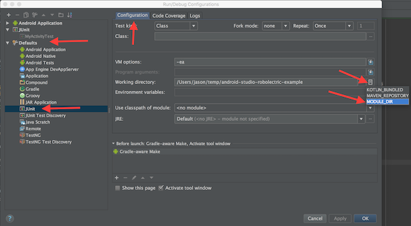
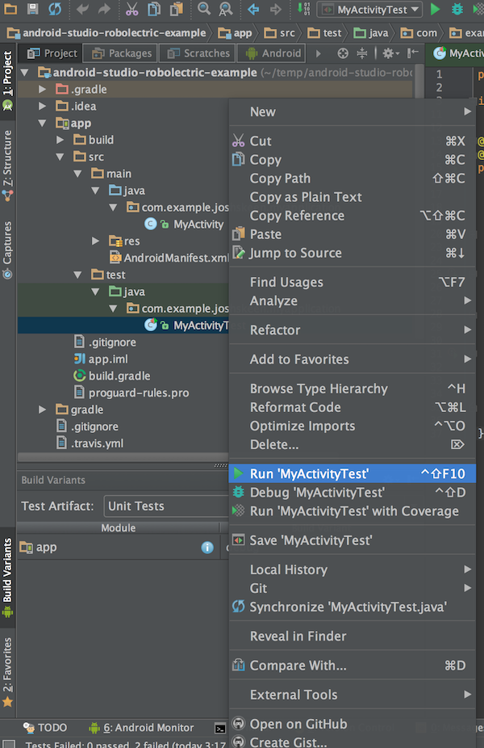

## Android Studio Robolectric Test Sample
This example project shows how to use robolectric, junit and assertJ with your gradle-based Android Studio projects.

### To set up from a new Android Studio Project: 
Add test dependencies on assertj-android and Robolectric to your module's build.gradle file. Your app module's app/build.gradle file would look something like this:
  
    testCompile 'com.squareup.assertj:assertj-android:1.1.0'
    testCompile 'org.robolectric:robolectric:3.0'


### How to Create your unit test 
-> in src/test/java/.myapplication/MyActivityTest.java:

@RunWith(RobolectricGradleTestRunner.class)
@Config(constants = BuildConfig.class, sdk = 21)
public class MyActivityTest {

    private MyActivity mActivity;

    @Before
    public void setup() {
        mActivity = Robolectric.buildActivity(MyActivity.class).create().get();
    }

    @Test
    public void myActivityAppearsAsExpectedInitially() {
        assertThat(mActivity.mClickMeButton).hasText("Click me!");
        assertThat(mActivity.mHelloWorldTextView).hasText("Hello world!");
    }

    @Test
    public void clickingClickMeButtonChangesHelloWorldText() {
        assertThat(mActivity.mHelloWorldTextView).hasText("Hello world!");
        mActivity.mClickMeButton.performClick();
        assertThat(mActivity.mHelloWorldTextView).hasText("HEY WORLD");
    }

}

### How to run Test:
1.  Select "Unit Tests" under "Build Variants"

2.  Update default JUnit working directory. Select *Run/Debug Configurations*, then *Defaults*, then *JUnit*, then *Configurations* tab, then *Working directory*, and finally *MODULE_DIR*.: 

3.  ctrl + click on the test and select Run MyActivityTest. 
```


